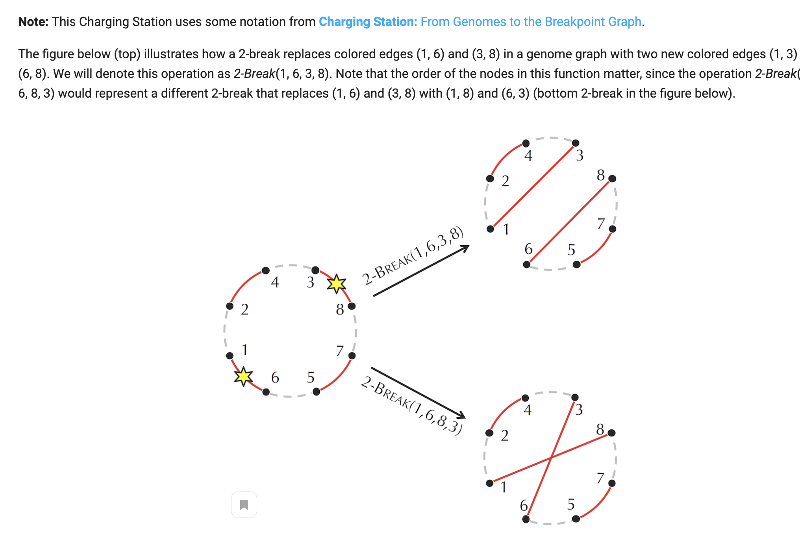
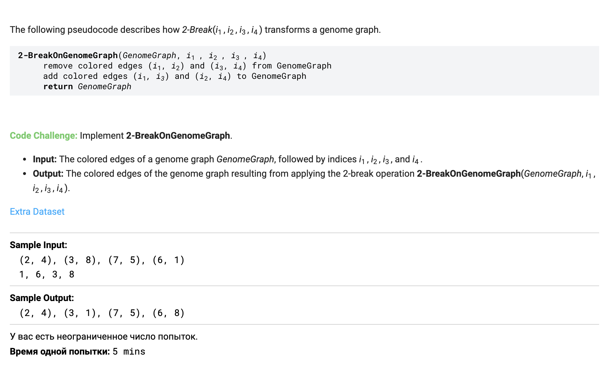
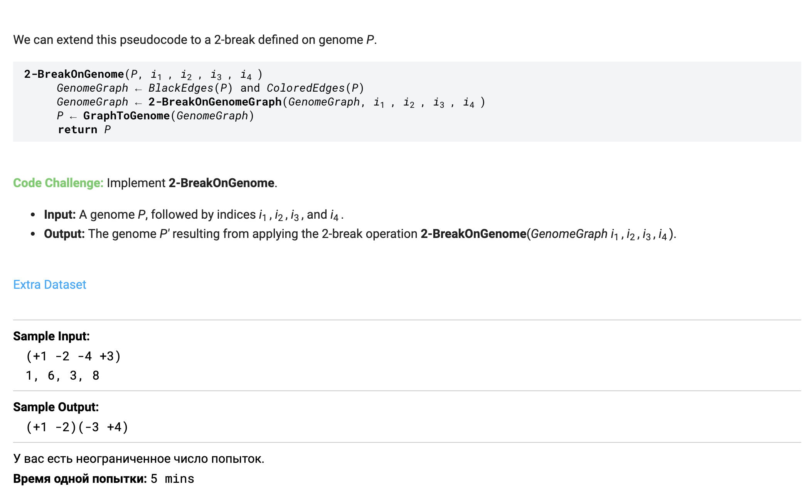
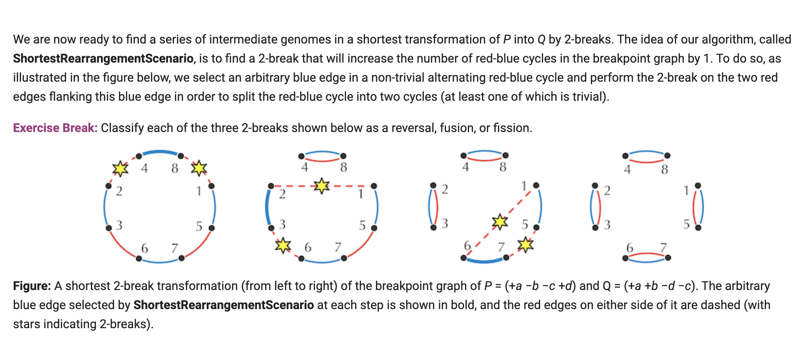
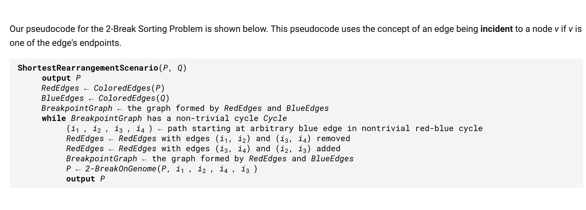

# Bioinformatics Algorithms

## Links

1. [Course book](https://www.bioinformaticsalgorithms.org/)
2. [Rosalind](http://rosalind.info/problems/list-view/)
3. [Coursera](https://www.coursera.org/learn/dna-analysis)

## Modules

---

### Chapter 1: Algorithmic Warm-up

[Book: Replication origins](https://www.bioinformaticsalgorithms.org/bioinformatics-chapter-1)

Tasks: 1 – 5

Rosalind problems

1. [Find Patterns Forming Clumps in a String](http://rosalind.info/problems/ba1e/)
2. [Find a Position in a Genome Minimizing the Skew](http://rosalind.info/problems/ba1f/)
3. [Find All Approximate Occurrences of a Pattern in a String](http://rosalind.info/problems/ba1h/)
4. [Find the Most Frequent Words with Mismatches in a String](http://rosalind.info/problems/ba1i/)
5. [Find Frequent Words with Mismatches and Reverse Complements](http://rosalind.info/problems/ba1j/)

---

### Chapter 2: Brute Force Algorithms

[Book: Motif indentification](https://www.bioinformaticsalgorithms.org/bioinformatics-chapter-2)

Tasks: 6 – 10

Rosalind problems

1. [Implement GreedyMotifSearch](http://rosalind.info/problems/ba2d/)
2. [Implement GreedyMotifSearch with Pseudocounts](http://rosalind.info/problems/ba2e/)
3. [Implement RandomizedMotifSearch](http://rosalind.info/problems/ba2f)
4. [Implement GibbsSampler](http://rosalind.info/problems/ba2g/)
5. [Implement DistanceBetweenPatternAndStrings](http://rosalind.info/problems/ba2h/)

---

### Chapter 3: Greedy and Randomized Algorithms

[Book: Genome Assembly](https://www.bioinformaticsalgorithms.org/bioinformatics-chapter-3)

Tasks: 11 – 15

Rosalind problems

1. [Reconstruct a String from its k-mer Composition](http://rosalind.info/problems/ba3h/)
2. [Find a k-Universal Circular String](http://rosalind.info/problems/ba3i/)
3. [Reconstruct a String from its Paired Composition](http://rosalind.info/problems/ba3j/)
4. [Generate Contigs from a Collection of Reads](http://rosalind.info/problems/ba3k/)
5. [Construct a String Spelled by a Gapped Genome Path](http://rosalind.info/problems/ba3l/)

---

### Chapter 4: Graph Algorithms

[Book: Antibiotic Sequencing](https://www.bioinformaticsalgorithms.org/bioinformatics-chapter-4)

Tasks: 16 – 20

Rosalind problems

1. [Find Substrings of a Genome Encoding a Given Amino Acid String](http://rosalind.info/problems/ba4b/)
2. [Compute the Number of Peptides of Given Total Mass](http://rosalind.info/problems/ba4d/)
3. [Find a Cyclic Peptide with Theoretical Spectrum Matching an Ideal Spectrum](http://rosalind.info/problems/ba4e/)
4. [Implement LeaderboardCyclopeptideSequencing](http://rosalind.info/problems/ba4g/)
5. [Implement ConvolutionCyclopeptideSequencing](http://rosalind.info/problems/ba4i/)

---

### Chapter 5: Dynamic Programming Algorithms; Divide & Conquer

[Book: Sequence Alignment](https://www.bioinformaticsalgorithms.org/bioinformatics-chapter-5)

Tasks: 21 – 25

Rosalind problems

1. [Find the Minimum Number of Coins Needed to Make Change](http://rosalind.info/problems/ba5a/)
2. [Find the Length of a Longest Path in a Manhattan-like Grid](http://rosalind.info/problems/ba5b/)
3. [Find a Highest-Scoring Alignment of Two Strings](http://rosalind.info/problems/ba5e/)
4. [Find a Highest-Scoring Local Alignment of Two Strings](http://rosalind.info/problems/ba5f/)
5. [Find a Highest-Scoring Multiple Sequence Alignment](http://rosalind.info/problems/ba5m/)

---

### Chapter 6: Combinatorial Algorithms

[Book: Genome Rearrangements](https://www.bioinformaticsalgorithms.org/bioinformatics-chapter-6)

Tasks: 26 – 30

Rosalind problems

1. [Implement GreedySorting to Sort a Permutation by Reversals](http://rosalind.info/problems/ba6a/)
2. [Compute the Number of Breakpoints in a Permutation](http://rosalind.info/problems/ba6b/)
3. [Compute the 2-Break Distance Between a Pair of Genomes](http://rosalind.info/problems/ba6c/)
4. [Find a Shortest Transformation of One Genome into Another by 2-Breaks](http://rosalind.info/problems/ba6d/)
5. [Implement 2-BreakOnGenome](http://rosalind.info/problems/ba6k/)

Additional info here (in this chapter) usefull for 2 last problems:

